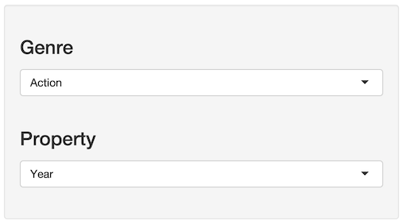

## Introduction

This set of slides attempts to explain the usage of the shiny app
I created for the course project of the Developing Data Products class on
Coursera.

The app description is as follows:

<pre>
This app can be used to explore the movies data set provided with the ggplot2 library in R.
The side bar allows you to choose a genre of movies as well as a selected property.
The below plot displays a histogram of the distribution of values of the selected property
for the selected genre.
Aditionally, a green line is drawn where the mean of that property for the genre is
located and a red line for the mean same property across all genres.
</pre>

A live version of the shiny app can be found on [http://bit.ly/1zYS14l](http://bit.ly/1zYS14l).

The GitHub page is [https://github.com/owo/devdataprod_project](https://github.com/owo/devdataprod_project).

---

## Controls

The app features two controllable parameters:

  1) Genre: Action, Animation, Comedy, Drama, Documentary, Romance, and Short.
  2) Property: Year, Length, Budget, and Rating.

---

## Output

The output is a histogram distribution of the selected property for all movies belonging to the selected genre.
In this case, we are looking at the distribution of Animation movies over year of production.

---

## Output (continued)

Also notice the red and turquoise lines.

The red line represents the mean of the selected property over all genres.

The turquoise line rpresents the mean of the selected property over only the selected genre.

While this tool is very simple, it does provide a way to get a sense of the data very quickly without having to write R code.
